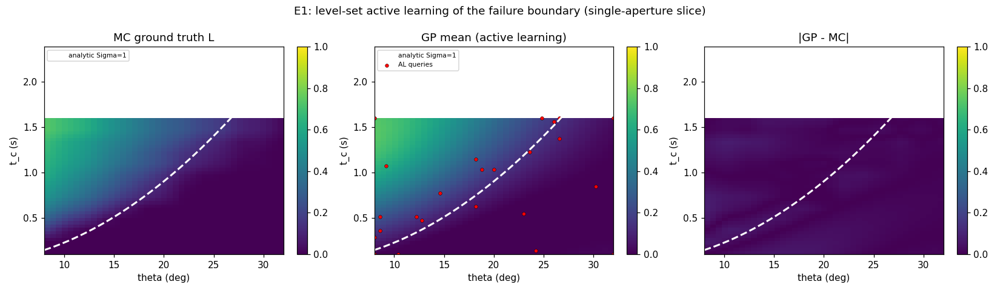

# E1 — GP surrogate + level-set active learning (preliminary results)

**Experiment E1 of `research-proposal-certified-defense.md`. Script:
`analysis/e1_gp_surrogate.py`. 2026-07-20.**

## Goal

Validate method **M1** (level-set active learning of the failure boundary): can a GP
surrogate learn the defense failure manifold `∂_τ(d) = {a : L(d,a)=τ}` sample-efficiently
from the stochastic simulator oracle, and does level-set active learning beat plain random
sampling at the same query budget?

## Setup

2-D slice with a **closed-form boundary for validation**: single aperture, axes
`(θ ∈ [8,32]°, t_c ∈ [0.1,1.6] s)`, fixed `R_eff=500 m, R_c=50 m, v=30 m/s, N=80`,
`n_cone=N` (pulse clears the cone → isolate the angular regime). The angular-saturation
model gives the analytic boundary `Σ = S(θ)·t_c·v/(R_eff−R_c) = 1`, i.e.
`t_c*(θ) = (R_eff−R_c)/v · (1−cos θ)`.

- **Oracle** `L(θ,t_c)`: mean leak over 3 seeds of the 3-D agent simulator.
- **Surrogate**: GP (RBF + WhiteKernel), inputs normalized.
- **Active learning**: LSE straddle acquisition `1.96·σ(a) − |μ(a)−τ|`, `τ=0.15`.
- **Ground truth**: dense 13×13 = 169-point Monte-Carlo grid.
- **Baseline**: random design at the same budget, averaged over 4 seeds.

## Results (budget = 24 oracle queries; dense grid = 169)

| Metric | Active learning | Random | 
|---|---|---|
| Global surrogate RMSE (leak) | 0.027 | 0.037 |
| **Boundary RMSE vs MC** (t_c, s) | **0.038** | **0.179** |
| Boundary recovered using | 24 queries (**14%** of dense grid) | — |

**Active learning is +79% more accurate on the boundary** than random at the same budget —
exactly where a level-set method should win. Global RMSE is close (random spreads everywhere);
the win shows up on the level-set metric the certificate depends on.

The figure (left → right): MC ground-truth leak `L`; GP mean with the 24 active-learning
queries (red) **clustered along the boundary**; absolute error `|GP − MC|`. The white dashed
curve is the analytic `Σ=1` boundary — it sits exactly on the MC transition, and the GP
recovers it.

## Takeaways for the proposal

1. **M1 works.** The GP surrogate reconstructs the failure boundary to `0.038 s` in `t_c`
   using 14% of the dense-grid budget; level-set active learning beats random by 79% on the
   boundary metric.
2. **Physical validation.** The learned and Monte-Carlo boundaries both coincide with the
   independent closed-form `Σ=1` curve — the surrogate is learning the real physics, not
   overfitting noise.
3. **Next (E2–E5).** Scale to the full attack space and test adversarial rediscovery (does
   black-box search find the zenith drop / hardening collapse?); add rare-event certification
   (M3) and Sobol/Shapley attribution (M4).

## Caveats

Single 2-D slice, homoscedastic noise model (WhiteKernel), order-of-magnitude simulator
(`hpm-saturation-model.md` §10). Boundary error is w.r.t. the MC estimate of the same model.
Reproduce: `python3 analysis/e1_gp_surrogate.py` (writes `e1_results.txt`, `e1_surrogate.png`).
