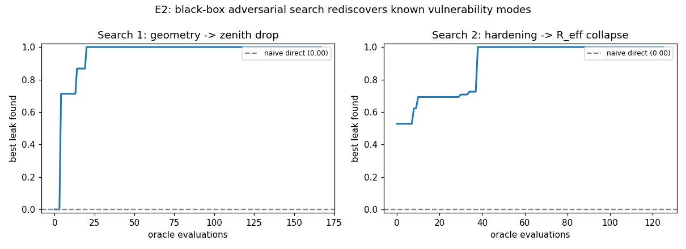

# E2 — black-box adversarial rediscovery (preliminary results)

**Experiment E2 of `research-proposal-certified-defense.md` (method M2). Script:
`analysis/e2_adversarial.py`. 2026-07-20.**

## Goal

The proposal's sharpest novelty test: given only a bare **"maximize penetration"** objective
against a fixed defense, does gradient-free adversarial search **autonomously rediscover the
vulnerability modes we derived by hand** — the zenith ballistic drop and the
hardening-induced range collapse — without being told they exist? Automatic rediscovery of
independently-derived modes is strong evidence the method finds *real* vulnerabilities.

## Setup

- **Defense (fixed):** 4 installations at the corners of a 1-ha square, calibrated
  `θ=30°, n_cone=49, el_max=80°, R_eff=500 m` — the configuration that **holds against a
  direct attack** (naive direct leak = 0.000; see `hectare-results.md`).
- **Optimizer:** `scipy.optimize.differential_evolution` (black-box, gradient-free).
- **Objective:** mean leak over 2 seeds, `N=200`. The optimizer sees only leak; it is told
  nothing about drops, elevation gaps, or hardening.
- Two searches over disjoint attack parameterizations, each targeting one mode:
  - **Search 1 — geometry only** (soft COTS): `x = [mode, el_center, el_spread, apogee]`.
  - **Search 2 — direct approach + hardening**: `x = [shielding_dB, el_center, v]`, where
    shielding scales the defense's effective range `R_eff_eff = R_eff / 10^(dB/20)`.

## Results

| | discovered configuration | best leak | rediscovered? |
|---|---|---|---|
| naive direct attack | el 5–55°, direct | **0.000** | — |
| **Search 1 (geometry)** | **mode = zenith drop (S6), apogee = 869 m** | **1.000** | **YES** |
| **Search 2 (hardening)** | **shielding = 21.9 dB → R_eff_eff = 40 m** | **1.000** | **YES** |

From a defense that holds completely (leak 0), the optimizer independently drove leak to
**1.0 by two different routes**: (1) climbing above the zenith cone-of-silence floor
(869 m > the 401 m floor at el_max=80°) and free-falling — the **zenith drop**; (2) hardening
the drones ~22 dB, collapsing effective range 500 m → 40 m — the **R_eff/E_kill collapse**.
Both modes were derived analytically *before* this search (see `zenith-drop-results.md`,
`hectare-results.md`); the optimizer found them with no prior knowledge.

Best-leak-so-far vs oracle evaluations. Search 1 reaches 1.0 within ~20 evaluations; Search 2
jumps to 1.0 near evaluation ~38, when shielding crosses the threshold that collapses `R_eff`.
Both start from the defense that holds (dashed line at 0).

## Takeaways for the proposal

1. **M2 works, and it validates the framework.** Black-box adversarial search recovers
   hand-derived vulnerability modes autonomously — the core evidence that the method finds
   real, not artifactual, weaknesses.
2. **Two independent routes to total penetration** were found against a defense that is
   robust to raw numbers — reinforcing that the exploitable axes are *geometry* (top attack)
   and *target hardening* (range collapse), not swarm size.
3. **Next.** Full-space search (does it find *new* modes beyond the two known ones?); then
   E3 certification over the region where no attack in a budget breaks the defense, and E4/E5
   (rare-event, sensitivity).

## Caveats

Order-of-magnitude simulator (`hpm-saturation-model.md` §10); 2 seeds/eval and small DE
budget (fast prototype) — final runs need more seeds and larger budgets with variance control.
The parameterizations are deliberately scoped per mode; a single joint search is future work.
Reproduce: `python3 analysis/e2_adversarial.py` (writes `e2_results.txt`, `e2_trace.png`).
