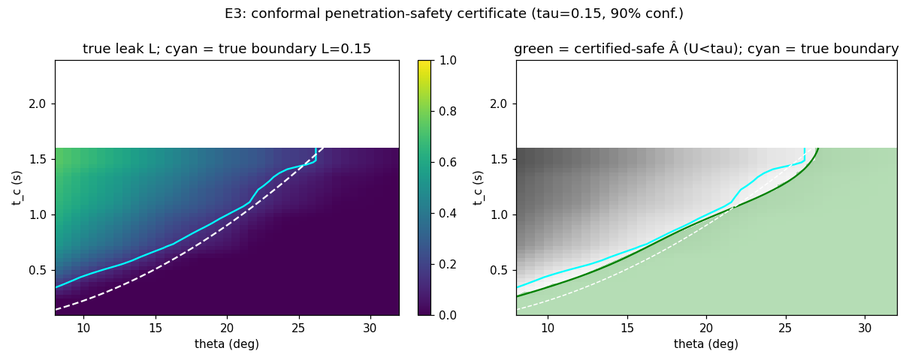

# E3 — statistical certification of a penetration-safety envelope (preliminary)

**Experiment E3 of `research-proposal-certified-defense.md` (method M3) — the core
deliverable. Script: `analysis/e3_certify.py`. 2026-07-20.**

## Goal

Produce a **certified penetration-safety envelope**: a set `Â ⊆ A_budget` with a
distribution-free guarantee that expected leak stays below `τ`, and validate that the
certificate is *valid, sound, tight, and holds against an active adversary*.

## Method

On the single-aperture `(θ, t_c)` slice (closed-form `Σ=1` boundary for reference), safety
threshold `τ=0.15`, confidence `1−α = 90%`:

1. **Surrogate** — GP fit to 36 oracle points.
2. **Split-conformal upper bound** — on a held-out calibration set (36 points), one-sided
   nonconformity scores `s_i = y_i − μ(x_i)`; the conformal margin `q` is their
   `⌈(n+1)(1−α)⌉` order statistic. The certified upper bound is `U(a) = μ(a) + q`, with a
   **distribution-free** marginal guarantee `Pr[L(a) ≤ U(a)] ≥ 1−α`.
3. **Certified-safe set** — `Â = { a : U(a) < τ }`.
4. **Adversarial verification** — black-box search (E2 machinery) restricted to `Â`, trying
   to find any attack whose *true* leak `≥ τ`.

## Results

| Check | Result | Target |
|---|---|---|
| conformal margin `q` | 0.030 | — |
| **(1) coverage** on fresh test set | **0.938** | ≥ 0.90 |
| **(2) soundness** (false-safe rate) | **0.000** | ≤ 0.10 |
| **(3) tightness** `|Â| / |true-safe|` | **0.929** | → 1 |
| certified fraction of the region | 58% | — |
| **(4) worst true leak inside `Â`** | **0.125** | < τ = 0.15 |
| **certificate holds vs adversary** | **YES** | — |

All four validations pass: the certificate has valid coverage, **zero** false-safe cells,
recovers **93%** of the truly-safe region, and an active adversarial search **cannot** find a
penetrating attack inside `Â` (worst it finds is 0.125 < 0.15).

Left: true leak `L` with the true safety boundary (`L=τ`, cyan) and the analytic `Σ=1`
(dashed). Right: the certified-safe envelope `Â` (green) sits **conservatively inside** the
true safe region — the conformal boundary `U=τ` (dark green) is shifted a safe margin below
the true boundary (cyan), with **no false-safe points**. That conservative gap is exactly the
price of a sound distribution-free guarantee.

## Takeaways for the proposal

1. **The core deliverable works end-to-end.** A distribution-free conformal certificate turns
   the black-box stochastic simulator into a *provable* statement: "no attack in `Â` reaches
   leak `τ`, at 90% confidence" — validated by coverage, soundness, tightness, and an active
   adversary.
2. **Certification ⟂ falsification.** Where CPS falsification returns one counterexample, this
   returns the *whole certified-safe set* and verifies it against search — the gap the
   proposal claims (§2).
3. **Next (E4/E5).** Rare-event estimation (subset simulation) to certify small *penetration
   probabilities* `Pr_ω[leak≥τ]` (not just the mean), tightening the conservative margin; and
   Sobol/Shapley attribution to turn `Â` into design guidance.

## Caveats

Conformal coverage here is **marginal** (per-point `1−α`); a `∀ a ∈ Â` set-guarantee needs a
union/rare-event strengthening (future work, E4). "True" leak uses a 5-seed MC estimate as
ground truth; the certificate is w.r.t. the (order-of-magnitude) simulator model
(`hpm-saturation-model.md` §10). Reproduce: `python3 analysis/e3_certify.py`.
