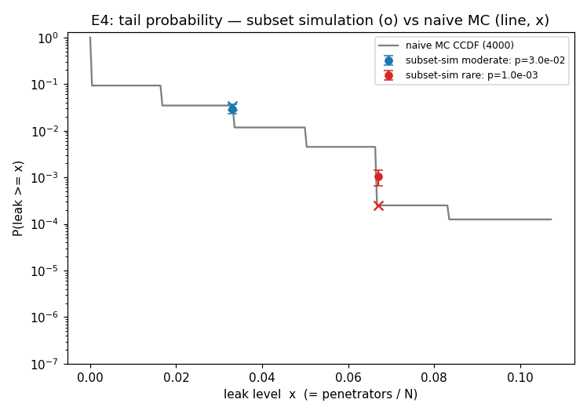

# E4 — rare-event certification of the penetration probability (preliminary)

**Experiment E4 of `research-proposal-certified-defense.md` (method M3, tail). Script:
`analysis/e4_rare_event.py`. 2026-07-20.**

## Goal

E3 certified the **mean** leak `L(d,a)=E_ω[leak]`. Here we certify the small **tail
probability** `p(a) = Pr_ω[leak ≥ τ]` in the safe region — the quantity a `∀ a ∈ Â`
set-guarantee ultimately needs — where naive Monte-Carlo sees ~0 events. We use
**Subset Simulation** (Au & Beck 2001): decompose a rare probability into a product of
per-level conditional fractions, sampled by component-wise Modified Metropolis.

The randomness is made **explicit**: for a fixed attack, `ω ∈ R^{2N}` perturbs the spawn
azimuth/elevation of the `N=60` drones; with a hard-step kill law `g(ω)=leak(ω)` is a
deterministic function of `ω ~ N(0,I)`, so the tail is a well-defined rare event in `ω`-space
(dim 120). Config `θ=15°, t_c=0.60, n_cone=6` sits at `Σ≈1.27`, `E[leak]≈0.0017` — a safe
region with a genuine rare tail.

## Method note — a real bug, fixed

A first implementation multiplied by the nominal `p0` at every level. When
`Pr(leak>0) < p0` the `p0`-quantile ties at 0, the level fails to thin, and the estimate is
divided by `p0` spuriously — underestimating `p` by ~100×. The corrected algorithm uses the
**actual** per-level conditional fraction and, on a degenerate (zero) threshold, thins to the
positive-leak samples. This is the standard fix for discrete performance functions.

## Results (Ns=250, 4 subset-sim runs, naive budget 4000)

**Moderate threshold — validation (naive MC is reliable here):**

| `τ = 0.033` (≥2/60) | estimate | budget |
|---|---|---|
| naive MC | `3.5e-2` (139 hits, rel.err 0.08) | 4000 |
| **subset-sim** | **`3.0e-2 ± 7e-3`** | **500 /run (12% of naive)** |

Subset simulation **agrees with reliable naive MC within 0.9×** using ~12% of the budget —
this validates the estimator.

**Rare threshold — subset-sim only (naive MC is blind):**

| `τ = 0.067` (≥4/60) | estimate | budget |
|---|---|---|
| naive MC | `2.5e-4` (**1 hit**, rel.err 1.0 — unusable) | 4000 |
| **subset-sim** | **`1.0e-3 ± 3.7e-4`** (runs: 1.2, 0.5, 1.5, 1.0 ×10⁻³) | **937 /run** |

Naive MC sees a single event and cannot estimate `p`; subset simulation resolves it stably
across 4 runs. Naive MC would need **~11× the subset-sim budget** just to reach `CoV=0.3` at
this rarity.

Gray: naive MC CCDF `P(leak≥x)` — accurate down to ~10⁻² but pure noise in the tail. Blue:
subset-sim at the moderate level, on top of the naive estimate (validation). Red: subset-sim
at the rare level with its 4-run spread, resolving `p≈10⁻³` where naive has a single point.

## Takeaways for the proposal

1. **The tail is certifiable.** Subset simulation estimates a per-config penetration
   probability `Pr_ω[leak≥τ]≈10⁻³` that naive MC cannot resolve at feasible budget —
   moving the certificate from the *mean* (E3) toward a *tail* guarantee.
2. **Validated, not just asserted.** Where naive MC is reliable, subset-sim agrees within
   0.9×; only then do we trust it in the rare regime.
3. **Path to a `∀`-set certificate.** Per-config tail bounds are the ingredient for
   strengthening E3's marginal conformal guarantee toward `Pr[∀ a∈Â: leak<τ]` via a union /
   rare-event bound (future work).

## Caveats

Order-of-magnitude simulator; `g` is discrete (leak = k/60), which biases level thresholds —
mitigated by the actual-fraction fix but not eliminated. Subset-sim CoV at the rare level is
~0.36 at Ns=250; production use needs larger `Ns` and a formal CoV estimate. Reproduce:
`python3 analysis/e4_rare_event.py` (or `E4_SMOKE=1 …` for a fast check).
