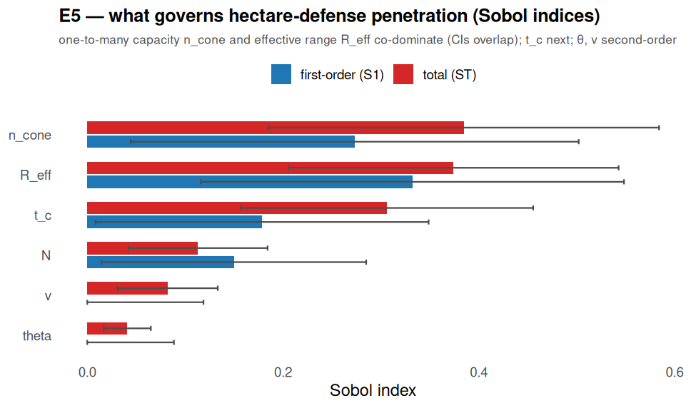

# E5 — global sensitivity attribution (Sobol) → design guidance

**Experiment E5 of `research-proposal-certified-defense.md` (method M4). Script:
`analysis/e5_sensitivity.py`. 2026-07-20.**

## Goal

Which parameters govern the penetration of the 1-hectare / 4-installation defense? Global
(variance-based) **Sobol** first-order `S1` and total-order `ST` indices turn the certificate
into **design guidance**: what to invest in, and what the adversary's strongest lever is.

## Setup

SALib Saltelli sampling, `N=64` → 512 configurations × 2 seeds. Direct attack (S0). Six
parameters over ranges that straddle the failure boundary:

| param | range | meaning |
|---|---|---|
| `R_eff` | 50–600 m | effective range (encodes drone hardening: `R_eff ∝ 1/E_kill`) |
| `theta` | 8–35° | beam half-angle |
| `t_c` | 0.3–2.0 s | engagement cycle |
| `n_cone` | 1–50 | one-to-many capacity (kills/pulse) |
| `N` | 100–800 | swarm size |
| `v` | 20–50 m/s | approach speed |

## Results

| param | S1 | ST |
|---|---|---|
| **n_cone** | 0.273 | **0.385** |
| **R_eff** | 0.332 | **0.374** |
| t_c | 0.178 | 0.306 |
| N | 0.150 | 0.113 |
| v | −0.024 | 0.082 |
| theta | −0.003 | 0.041 |

Confidence intervals (ST_conf) are ~0.15–0.20 for the top parameters, so **`n_cone` and
`R_eff` are statistically co-dominant** (their CIs overlap), followed by `t_c`. Beam half-angle
`theta` and approach speed `v` are second-order in this direct-attack regime.

## Design guidance (the deliverable)

1. **Two co-equal levers govern direct-attack penetration: one-to-many capacity `n_cone` and
   effective range `R_eff`.** Invest in both first. `n_cone` sets how many drones a pulse
   clears (service rate); `R_eff` sets the engagement envelope.
2. **The adversary's strongest lever is collapsing `R_eff` via drone hardening**
   (`R_eff ∝ 1/E_kill`): a modest +dB of shielding moves along the most influential axis. This
   is the quantitative confirmation of the E2 hardening-collapse mode.
3. **`t_c` (engagement cycle) is the third lever** — shortening acquisition/pulse/confirm helps.
4. **Beam width `theta` and speed `v` are second-order here** — because at these ranges the
   one-to-many pulse clears the cone regardless of width. (Beam width *does* dominate the
   single-aperture *angular*-saturation regime, §7 of the model; sensitivity is regime-specific.)

## Caveats

`N=64` (512 configs) gives wide CIs; the co-dominance of `n_cone`/`R_eff` is robust but their
exact order is not. Output is bimodal (leak often 0 or high), which inflates variance-based CIs.
Direct-attack (S0) regime only — the zenith/`el_max` axis (a separate failure mode, §8.4) is not
in this parameter set. Order-of-magnitude simulator (`hpm-saturation-model.md` §10). Reproduce:
`python3 analysis/e5_sensitivity.py`.
