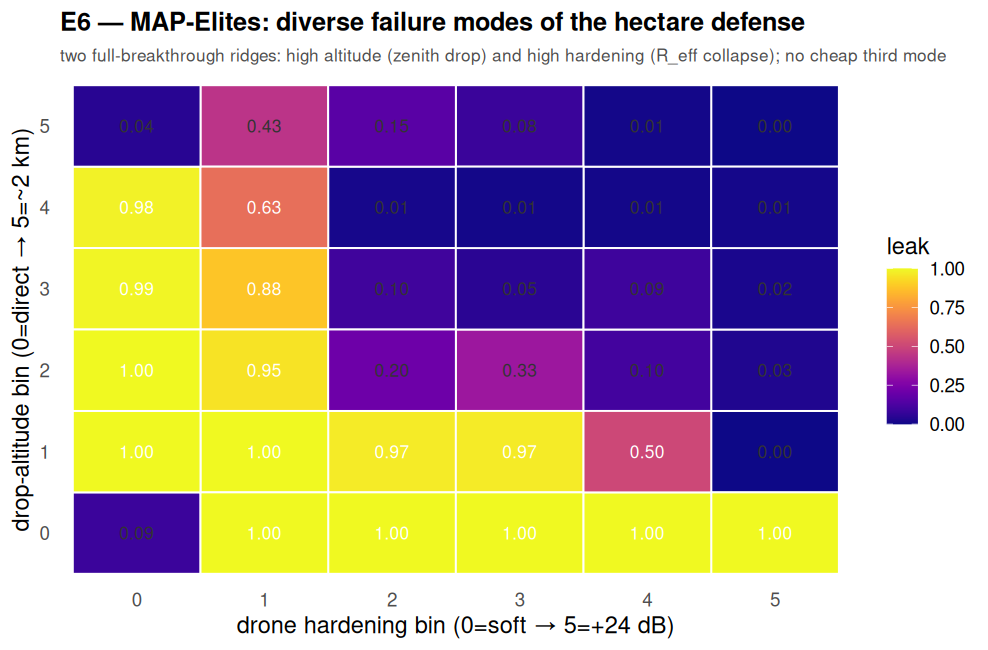

# E6 — quality-diversity (MAP-Elites) joint search for new failure modes

**Beyond the 5 proposal experiments. Script: `analysis/e6_novelty_search.py` (parallel).
2026-07-20.**

## Question

E2 rediscovered two *hand-derived* modes with scoped searches. Does a **joint** search over a
combined attack genome find a **new** mode? We use MAP-Elites (quality-diversity): instead of
one optimum, we fill a map of diverse high-penetration strategies. Behavior descriptors: the
two axes of the known modes — **drop altitude × drone hardening**. Hidden genome levers
(approach elevation, **speed up to 600 km/h**, azimuth seam-routing) let the optimizer discover
strategies the descriptors don't encode. The question: is there high leak in the **cheap
corner** (low altitude AND low hardening)?

## Setup

Calibrated 4-corner hectare, `N=400`, genome `[apogee, hardening, el_center, v, seam]`.
Batched MAP-Elites (each generation's mutations evaluated in parallel across 16 cores):
40 init + 360 mutations ≈ 800 sims in ~49 s.

## Results — the diversity map

Best leak per (altitude bin × hardening bin):

Two **full-breakthrough ridges**: the left column (soft) lights up at altitude bins 1–4 (the
**zenith drop**), and the bottom row (direct) lights up at hardening bins 1–5 (the **hardening
collapse**). The **cheap corner** (direct + soft, alt-bin 0 / hard-bin 0) stays at leak ≈ 0.09
— the defense holds.

Classification of every high-leak (≥0.5) elite by the actual lever used:

| lever | full-breakthrough elites |
|---|---|
| drop (apogee > 150 m) | 14 |
| hardening (> 6 dB) | 2 |
| high-speed / seam-routing / direct-soft-slow | **0** |

## Findings

1. **No new *full*-breakthrough mode.** Against this defense and genome, the only strategies
   reaching leak ≥ 0.5 are the two known axes (altitude, hardening). The cheap corner holds.
   This is a useful **negative result** — a joint QD search over altitude, hardening, elevation,
   speed, and seam-routing surfaces no cheap third full mode.
2. **Speed is a real but *partial* third axis** (quantified separately in E7). At the
   calibrated `t_c=1.0` a direct+soft+fast (>400 km/h) strategy reaches only ~0.09–0.18 — below
   the full-breakthrough bar, but nonzero; it dominates once `t_c` is larger (E7).
3. **The map is the artifact.** It shows the *frontier* of minimum adversary investment: soft
   drones need a mid-altitude drop; direct drones need ≥1 hardening bin; very high altitude
   (bin 5) drops off (ballistic CEP misses). This frontier is design guidance for the defender.

## Caveats

MAP-Elites at 400 evals gives a coarse 6×6 map; the negative result is w.r.t. this genome and
budget. Bin 0 mixes direct (apogee < 150 m) with low drops (150–333 m). Fixed `t_c=1.0`,
`N=400`. Order-of-magnitude simulator. Reproduce: `python3 analysis/e6_novelty_search.py`.
