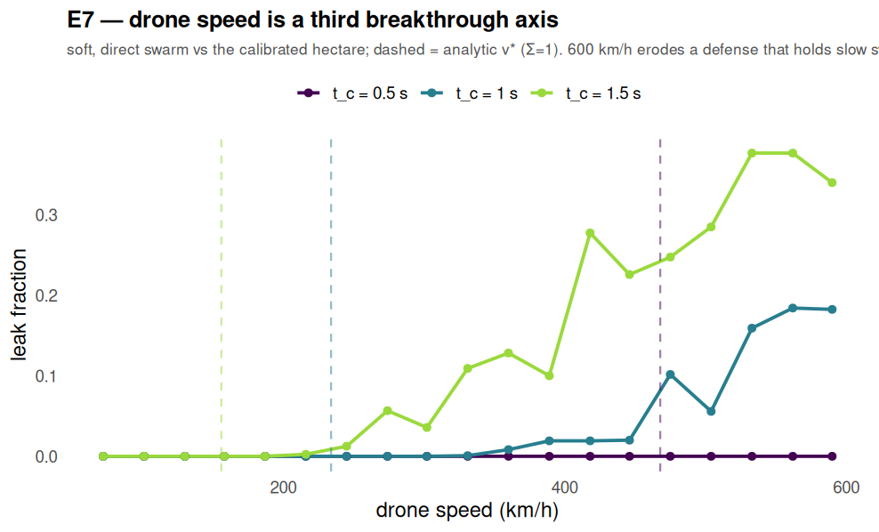

# E7 — drone speed as a third breakthrough axis (up to 600 km/h)

**Added research question. Script: `analysis/e7_speed.py` (parallel, all cores). 2026-07-20.**

## Question

Fast attack drones (Shahed / jet-FPV class, up to ~167 m/s = **600 km/h**) shrink the transit
time `τ = (R_eff − R_c)/v`, so the saturation ratio `Σ = T_r/τ = S(θ)·t_c·v/(R_eff − R_c)`
grows **linearly with speed**. Does speed alone break a one-to-many defense that holds against
large slow swarms?

## Setup

Calibrated 4-corner hectare (`θ=30°`, `n_cone=49`, `R_eff=500 m`), soft/unhardened swarm
`N=400`, direct approach. Sweep speed 72–612 km/h for three engagement cycles `t_c`. Runs on
all 16 cores (171 sims in ~1 s).

## Results

Leak fraction vs speed (soft, direct swarm):

| t_c | 187 km/h | 360 km/h | 475 km/h | 590 km/h |
|---|---|---|---|---|
| 0.5 s | 0.00 | 0.00 | 0.00 | 0.00 |
| 1.0 s | 0.00 | 0.01 | 0.10 | 0.18 |
| 1.5 s | 0.00 | 0.13 | 0.25 | 0.34 |

## Findings

1. **Speed is a genuine third breakthrough axis** — alongside altitude (zenith drop, E6/§8.4)
   and hardening (`R_eff` collapse, E2). A 600 km/h swarm penetrates a hectare that holds
   against 2000 slow drones, **without any hardening or drop**.
2. **Its strength depends on the engagement cycle `t_c`.** At a fast cycle (`t_c=0.5`) the
   defense holds to 600 km/h; at `t_c=1.0` speed erodes it to leak ~0.18; at `t_c=1.5` to
   ~0.34. Speed and cycle-time trade off exactly as `Σ ∝ t_c·v`.
3. **Four apertures are more robust than the single-aperture `v*`.** The analytic critical
   speed `v*` (where single-aperture `Σ=1`) is a lower bound; the 4-corner ring shares the
   revisit work, so the simulated onset is higher than `v*` (dashed lines). Honest gap.
4. **Design implication:** against fast threats, shortening `t_c` (acquisition→pulse→confirm)
   or adding apertures matters more than raw range; speed cannot be countered by `n_cone`
   (the pulse still clears its cone, but the beam runs out of *revisits* before the fast swarm
   crosses).

## Note on parallelization

More variables (speed × cycle × seeds) motivated running the simulator across all CPU cores
(`analysis/parallel_eval.py`, `ProcessPoolExecutor`). The simulator is deterministic and each
run independent, so this is embarrassingly parallel: ~10× wall-clock speedup on 16 cores, with
bit-identical results. E5 (Sobol) and E6 (MAP-Elites) also use it.

## Caveats

Order-of-magnitude simulator (`hpm-saturation-model.md` §10). `R_c=15 m`, `N=400` fixed;
the speed axis strengthens with larger `t_c` / smaller `R_eff`. Reproduce:
`python3 analysis/e7_speed.py`.
