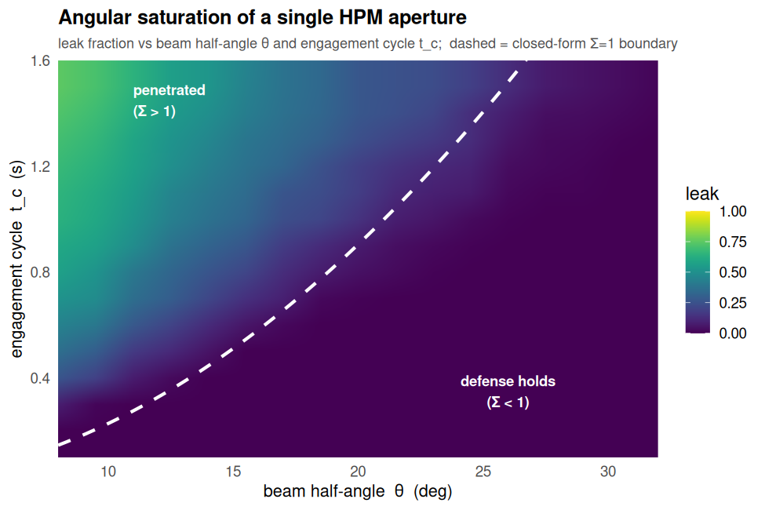
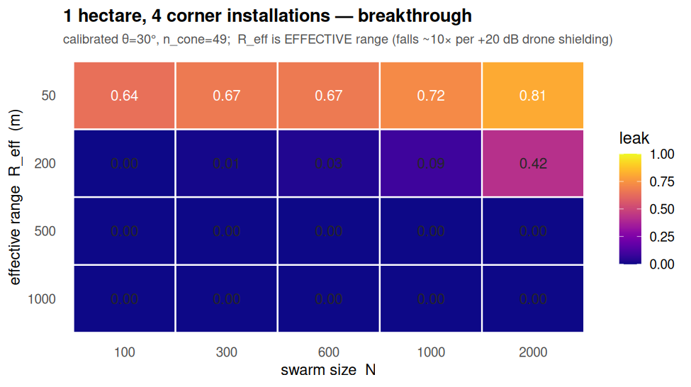
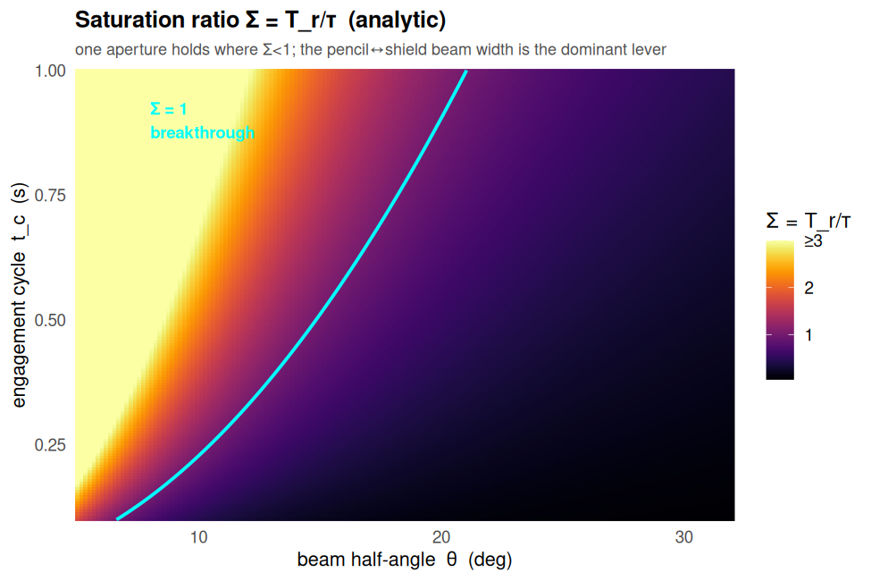

# Figures (R / ggplot2)

Publication-quality figures built in **R 4.3 with ggplot2 + viridis**, exported as **SVG**
(crisp, scalable, renders natively on GitHub) and **PNG**. Data is exported from the Python
simulator to CSV, then plotted in R.

```bash
Rscript figures/make_figures.R      # regenerates all figures from the CSVs
```

## Gallery

### Angular saturation phase map
`fig_saturation_phase` — leak fraction vs beam half-angle θ and engagement cycle t_c for a
single aperture; the dashed line is the closed-form `Σ=1` boundary, which sits exactly on the
simulated transition.



### 1-hectare / 4-installation breakthrough
`fig_hectare_breakthrough` — with the calibrated one-to-many pulse the site is robust to raw
swarm size; the breakthrough axis is **effective range** (drone hardening collapses it).



### Saturation-ratio sensitivity (analytic)
`fig_sigma_sensitivity` — `Σ = T_r/τ`; the defense holds where Σ<1, and beam width dominates.



## What R can (and can't) do here

**Available now** (`ggplot2`, `viridis`, `scales`, base `svg()` cairo device):
- Static, paper-ready **SVG/PNG** — heatmaps, phase maps, contours, tiled tables, faceted
  multi-panels, error-bar/CCDF plots. All render natively in GitHub markdown.

**Additional figures worth building** (same toolchain, just need the CSV):
- E1–E4 panels re-styled in ggplot2 (boundary recovery; optimization traces; certified-safe
  region; tail CCDF) for a consistent paper look.
- Cost-exchange ratio (CER) vs breakthrough mode; `R_eff ∝ 1/E_kill` collapse curve.
- Schematic diagrams: the zenith cone-of-silence and fratricide no-fire arcs (geometry).
- Faceted sensitivity grids (θ × t_c × R_eff × v) as small multiples.

**Not available without installing packages** (no network assumed):
- Interactive figures (`plotly`/`htmlwidgets`) — and GitHub does not render interactive HTML
  in README anyway; those need **GitHub Pages**. `patchwork`/`svglite` are replaced by facets
  and the base `svg()` device.

> Numbers are order-of-magnitude on the open-source simulator (`hpm-saturation-model.md` §10).
